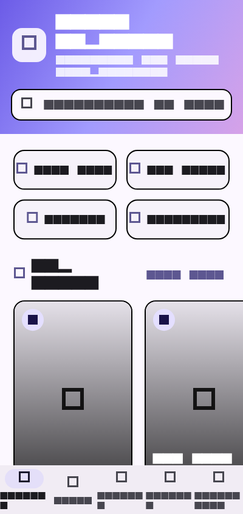
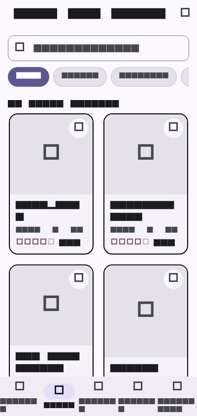

# App e-commerce avec Riverpod

Application Flutter e-commerce multi-ecrans utilisant exclusivement Riverpod comme solution de gestion d'etat, batie selon une architecture en couches stricte.

## Conformite au bareme

| Exigence | Implementation |
| --- | --- |
| Catalogue de produits (liste + detail) | `lib/screens/catalog_screen.dart` (grille, recherche, filtres) et `lib/screens/product_detail_screen.dart` (Hero animation, galerie, selecteur de quantite, avis) |
| Panier d'achat (ajout, suppression, quantite) | `lib/screens/cart_screen.dart` + `CartNotifier` (ajout, decrementation/incrementation, swipe-to-delete, vidage, totaux) |
| Systeme de favoris persiste localement | `lib/providers/favorites_provider.dart` avec persistance `SharedPreferences` sur disque |
| Filtrage et tri des produits | `lib/providers/filter_provider.dart` (categories en Chips, recherche textuelle, tri par prix/note/nom) |
| Ecran de profil utilisateur (mock) | `lib/screens/profile_screen.dart` (avatar, adresse, telephone, historique des commandes mockees) |
| Riverpod exclusivement | Aucune autre librairie d'etat utilisee (`flutter_riverpod: ^2.6.1`) |
| Au moins 5 providers distincts | 7 providers crees : `productsFutureProvider`, `productDetailProvider`, `productFilterProvider`, `filteredProductsProvider`, `cartNotifierProvider`, `favoritesNotifierProvider`, `userProfileProvider` |
| Separation logique metier et widgets | Architecture en couches : `data/`, `models/`, `providers/`, `screens/`, `widgets/` |
| Gestion des etats de chargement et d'erreur | `lib/widgets/async_state_view.dart` avec spinner de chargement et bouton Reessayer |
| Utilisation de `AsyncValue` | Rendu reactif des donnees asynchrones via `AsyncValue` et `when` |
| Donnees mockees (JSON local) | Fichier `assets/products.json` charge de maniere asynchrone via `ProductRepository` |
| Bonus animations | Bouton anime `AnimatedAddToCartButton`, Hero animation, badge anime sur le panier |

## Providers Riverpod

| Nom du Provider | Type Riverpod | Role |
| --- | --- | --- |
| `productsFutureProvider` | `FutureProvider<List<Product>>` | Recupere la liste des produits depuis le repository asynchrone (`AsyncValue`) |
| `productDetailProvider` | `FutureProvider.family<Product?, String>` | Recupere le detail d'un produit par son ID |
| `productFilterProvider` | `StateNotifierProvider<ProductFilterNotifier, ProductFilter>` | Gere l'etat de la recherche, de la categorie active et de l'option de tri |
| `filteredProductsProvider` | `Provider<AsyncValue<List<Product>>>` | Provider combine filtrant et triant les produits reactivement |
| `cartNotifierProvider` | `StateNotifierProvider<CartNotifier, CartState>` | Gere l'etat immuable du panier (articles, quantites, sous-total, frais de port, total) |
| `favoritesNotifierProvider` | `StateNotifierProvider<FavoritesNotifier, Set<String>>` | Gere les IDs favoris avec persistance locale automatique via `SharedPreferences` |
| `userProfileProvider` | `StateNotifierProvider<UserProfileNotifier, UserProfile>` | Gere les donnees mockees du profil utilisateur et ses commandes |

## Apercu

Les captures sont dans [docs/screenshots](docs/screenshots).

| Accueil / Catalogue | Detail d'un produit | Panier d'achat |
| --- | --- | --- |
|  |  |  |

| Favoris | Profil utilisateur | Theme sombre |
| --- | --- | --- |
|  |  |  |

## Prerequis

- Flutter SDK (indique dans `pubspec.yaml`)
- Chrome, un emulateur, ou un appareil physique

```bash
flutter doctor
```

## Installation

```bash
git clone https://github.com/ILBOUDOChristian/App-e-commerce-avec-Riverpod.git
cd App-e-commerce-avec-Riverpod
flutter pub get
```

## Lancement

```bash
flutter run
```

## Verification

```bash
flutter analyze
flutter test
```

## Structure

```text
lib/
  app.dart          MaterialApp, theme Material 3
  main.dart         Point d'entree enveloppe dans ProviderScope
  data/             Repository asynchrone et donnees mockees
  models/           Modeles de donnees (Product, CartItem, ProductFilter, UserProfile)
  providers/        Logique metier et gestion d'etat Riverpod
  screens/          Ecrans principaux de l'application
  widgets/          Composants UI reutilisables (ProductCard, CartItemTile, AsyncStateView...)
assets/
  products.json     Catalogue de donnees JSON local
docs/
  screenshots/      Captures d'ecran de l'application
```